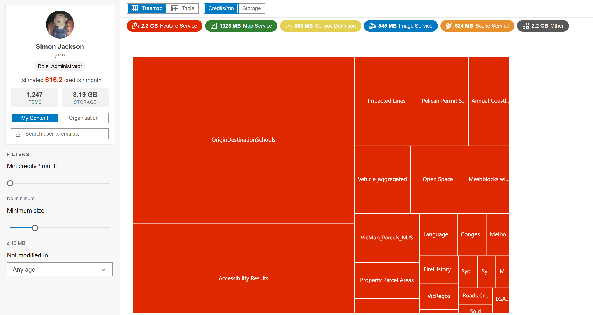
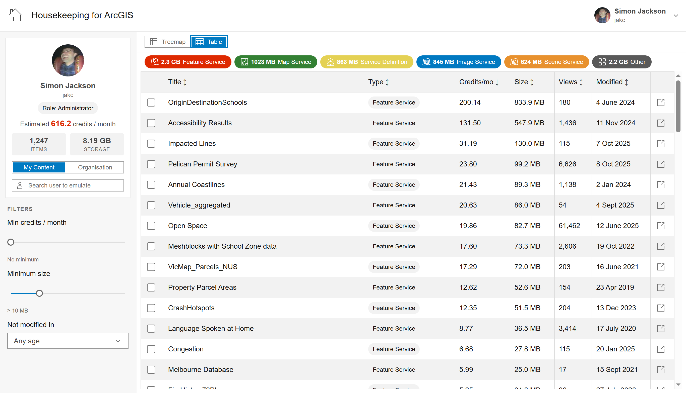
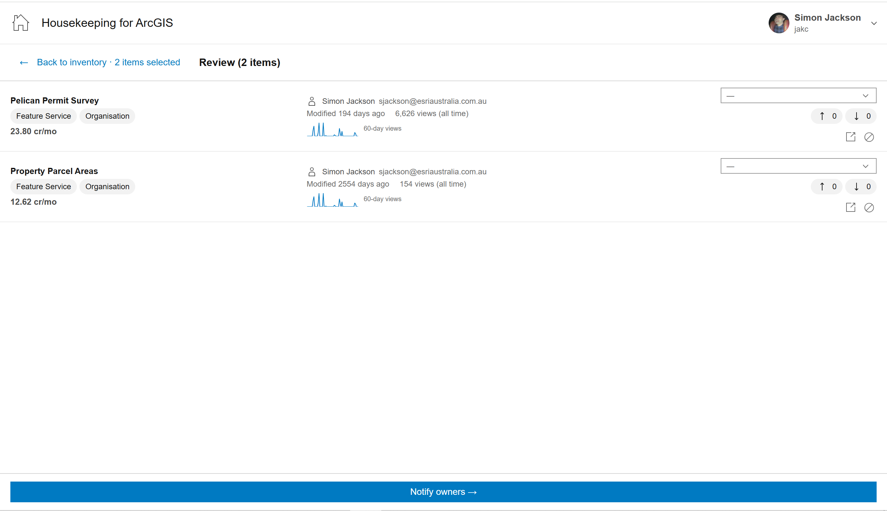
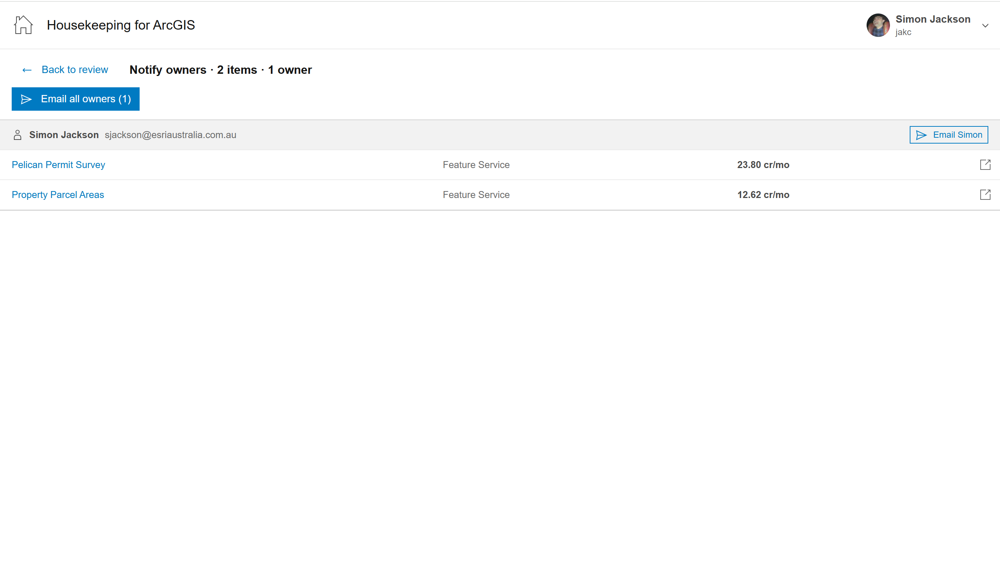

# Housekeeping for ArcGIS

[](https://cartinuum.github.io/housekeeping-for-arcgis)

Content intelligence and review tool for ArcGIS Online administrators and users.

Sign in with your ArcGIS Online account to visualise content at scale, identify items consuming the most credits or storage, triage a shortlist for review, and notify owners — all without leaving your browser.

**Live demo:** [Try it on GitHub Pages](https://cartinuum.github.io/housekeeping-for-arcgis) — uses the same sign-in flow as local development (an ArcGIS Online account is enough). If OAuth fails for your org, register a client ID for that URL; see [Register your own OAuth app (for self-hosting)](#register-your-own-oauth-app-for-self-hosting).



---

## What it does

The tool supports three stages in a single workflow:

### 1. Inventory

Visualise all your content (or your entire organisation's) as an interactive treemap. Tiles are sized by estimated credits/month or storage. Patterns and outliers are immediately obvious — Feature Services dominate by credits, large files dominate by storage.

Switch to **Table view** for a sortable list with size, credit cost, view count, and last modified date. Filter by item type, minimum size, minimum credits/month, and last modified date.



### 2. Triage

Select items from the inventory into a review basket. The **Review panel** fetches additional signals per item: activity tier (Active/Recent/Quiet/Dormant based on last viewed date and view count), dependency counts, owner email, and days since last modification. Tag items with a reason (Appears stale, Large footprint, No recent views, Duplicate content, Other) to inform the notification.



### 3. Action

The **Notify owners** panel groups selected items by owner and generates pre-filled email drafts via `mailto:` links. Each draft includes the item list, titles, ArcGIS Online links, and a reason tag if set. A clipboard fallback handles long drafts that exceed mail client URL limits.



### Emulation Mode (administrators only)

Org admins can view any user's content without logging in as them — the admin's own authenticated token is used against the target user's content endpoint. A warning banner appears on the triage and action screens as a reminder that actions affect the emulated user's content.

---

## Privacy and data handling

This is a client-only application. No data leaves your browser other than authenticated calls to ArcGIS Online. No analytics, no backend, no third-party trackers.

---

## Known limitations

- Org scope samples the top 50 users by storage usage — not a full org scan
- Treemap shows up to ~800 items in user scope and ~200 in org scope (sorted by active metric; exact cap scales with screen area)
- Credit estimates are heuristic, based on [published ArcGIS Online credit rates](https://doc.arcgis.com/en/arcgis-online/administer/credits.htm) — your org's rates may differ
- Storage metric returns `-1` for hosted Feature Services via org-wide search — switch to own-user scope for accurate per-item storage
- ArcGIS Online only — credit calculations will be incorrect if pointed at ArcGIS Enterprise

---

## Credit estimates

| Item type | Rate | Notes |
|---|---|---|
| Feature Service (hosted) | 2.4 cr / 10 MB / mo | ~240 cr/GB — highest cost by far |
| Notebook | 12 cr / GB / mo | Workspace scratch storage |
| Image Service | 1.2 cr / GB / mo | |
| Vector Tile Service | 1.2 cr / GB / mo | |
| Everything else | 1.2 cr / GB / mo | Files, packages, etc. |
| Web Maps, Dashboards, Apps | 0 | Report `size: -1` — no file storage |

---

## Register your own OAuth app (for self-hosting)

The default client ID (`bQXhIxIaShwu5Qzt`) is registered for the simongis deployment and `http://localhost:5173`. If you self-host at a different URL, you need to register your own application:

1. Sign in at [developers.arcgis.com](https://developers.arcgis.com/applications)
2. Click **New application** → give it a name (e.g. "Housekeeping for ArcGIS")
3. Under **Authentication** → **Redirect URIs**, add your deployment URL (e.g. `https://yourdomain.github.io/housekeeping-for-arcgis`)
4. Also add `http://localhost:5173` if you want local dev to work with your own ID
5. Copy the **Client ID**
6. Create `.env.local` in the repo root:
   ```
   VITE_ARCGIS_CLIENT_ID=your_client_id_here
   ```

---

## Getting started

### Prerequisites

- Node 18+
- An ArcGIS Online account (any role)

### Run locally

```bash
npm install
npm run dev
```

Open `http://localhost:5173`, click **Sign in with ArcGIS Online**, and approve access. The full browser tab redirects to ArcGIS Online and back — no popup.

### Build

```bash
npm run build
```

Output goes to `dist/` — deploy as a static site. Register your deployment URL as a redirect URI on your ArcGIS application (see above).

### Tests

```bash
npm test
```

### Lint

```bash
npm run lint
```

---

## Tech stack

| Concern | Choice |
|---|---|
| Build | Vite + React 18 + TypeScript |
| Server state | TanStack Query v5 |
| UI state | Zustand |
| UI components | [Calcite Design System 5](https://developers.arcgis.com/calcite-design-system/) |
| Charts | [Apache ECharts v5](https://echarts.apache.org/) |
| Auth | `@esri/arcgis-rest-request` v4 — PKCE OAuth2 |

See `CLAUDE.md` for full architecture documentation and technical discoveries.

---

## Licence

Apache-2.0 — see [LICENSE](LICENSE).

## Acknowledgements

- [Esri Calcite Design System](https://developers.arcgis.com/calcite-design-system/)
- [@esri/arcgis-rest-request](https://github.com/Esri/arcgis-rest-js)
- [Apache ECharts](https://echarts.apache.org/)
- [TanStack Query](https://tanstack.com/query/latest)
